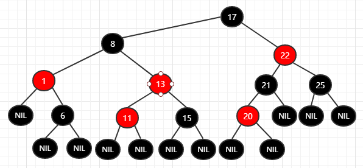

红黑树
===
### 一. 二叉查找树
二叉查找树特性:

- 左结点上的值都小于或等于其跟结点的值
- 右结点上的值都大于或等于其根结点的值

举个二叉查找树的例子:

如果要查询7的话, 根节点10>7

因此到它的左子树, 左子树根结点为6>7

因此到其右子树, 右子树根结点为8>7

到其左子树, 结点值为7, 找到相应的结点

不过二叉查找树有一些问题, 可能会出现不平衡的情况, 即如下图所示的情况

从这种情况可以看出, 明显存在左子树和右子树深度相差过多, 在使用平衡情况下的二叉查找树是时间复杂度为logn, 而出现这种极端情况的话, 想要查找9的位置就需要每一次都遍历下一个右子树, 很有可能时间复杂度变为n(与数组普通查询的时间复杂度相同)

> 基于上述情况, 引入了平衡二叉树, 红黑树即为平衡二叉树的一种

### 二. 红黑树

特性: 
- 结点是红色或黑色
- 根结点一定是黑色
- 每个叶子结点都是黑色的空结点(NIL结点)
- 每个红结点的两个子结点都是黑色的(从每个叶子到根的所有路径上不能有两个连续的红结点)(即对于层来说, 除了NIL结点, 红黑结点是交替的, 第一层是黑结点那么其下一层肯定都是红结点, 反之一样)
- 从任一结点到其每个叶子结点的所有路径都包含相同数目的黑色结点

正是由于这些原因使得红黑树是一个平衡二叉树.

红黑树的例子:

向红黑树中插入结点14(一般默认插入结点是红色的)

在原树上插入20

可以看到, 插入以后树已经不是一个平衡的二叉树, 而且并不满足红黑树的要求, 因为20和21均为红色, 这种情况下就需要对红黑树进行变色, 21需要变为黑色, 22就会变成红色, 如果22变成红色, 则需要17和25都变成黑色

而17变成黑色显然是不成立的，因为如果17变为黑色，那么13就会变为红色，不满足二叉树的规则，因此此处需要进行另一个操作---------左旋操作

左旋：下图就是一个左旋的例子，一般情况下，如果左子树深度过深，那么便需要进行左旋操作以保证左右子树深度差变小

对于上图由于右子树中17变为黑色以后需要把13变成红色，因此进行一次左旋，将17放在根结点，这样既可保证13为红色，左旋后结果

而后根据红黑树的要求进行颜色的修改

进行左旋后，发现从根结点17，到1左子树的叶子结点经过了两个黑结点，而到6的左叶子结点或者右叶子结点要经历3个黑结点，很显然也不满足红黑树，因此还需要进行下一步操作，需要进行右旋操作

右旋：与左旋正好相反

由于是从13结点出现的不平衡，因此对13结点进行右旋，得到结果

而后再对其结点进行变色，得到结果

这便是红黑树的一个变换，它主要用途有很多，例如java中的TreeMap以及JDK1.8以后的HashMap在当个结点中链表长度大于8时都会用到。

总结一下应该是 
1. 当出现新的结点时默认为红色插入，如果其父结点为红色，则对其递归向上换色，如果根结点由此变为红色，则对根结点进行左旋（右侧过深）或右旋（左侧过深），之后从根结点向下修改颜色
2. 从根结点检查红色结点是否符合路径上的黑色结点数量一致，如果不一致，对该结点进行左旋（右侧黑色结点数量更多）或右旋（左侧黑色结点数量更多），并变换颜色，重复2操作直到符合红黑树规则。
